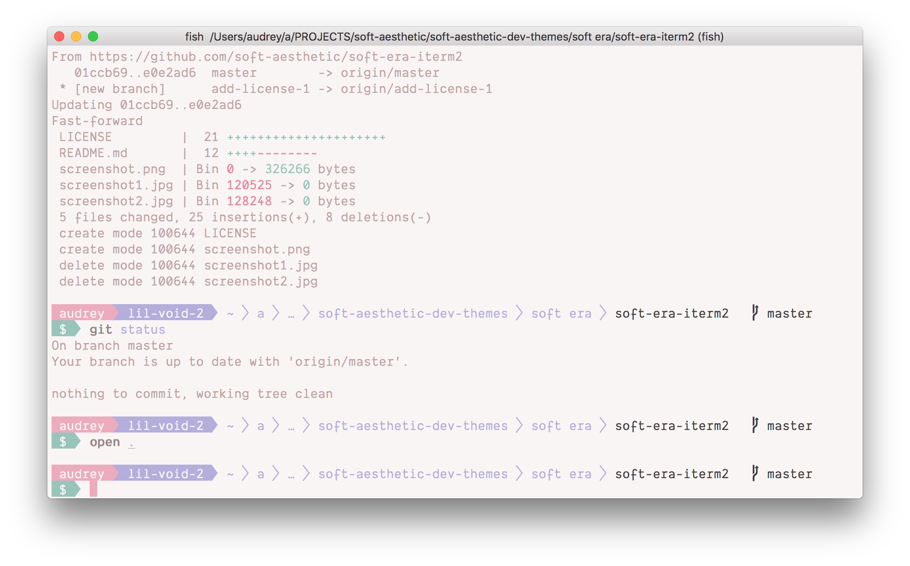

# \~ soft era \~

### syntax theme for [iTerm2](https://www.iterm2.com/)

🌸 Light pastel syntax theme for cozy, cute coding. 🌱

*ℹ️ : [powerline](https://github.com/b-ryan/powerline-shell) and shell configs for this screenshot outlined in [this gist](https://gist.github.com/lovemecomputer/3e61a20279db27b4aef108a419fc272e)*

\~.\~
 &nbsp;&nbsp;a soft, warm, low contrast theme,
 &nbsp;&nbsp;with pastel accents that are easy on your eyes

^.^
 &nbsp;&nbsp;make stuff and learn.
 &nbsp;&nbsp;make the world your kinda place.
 &nbsp;&nbsp;take care of the people around you

🌿

💾 enjoy <3

---

Happy to hear any input <3

💖 [@animalphase](https://twitter.com/animalphase) on twitter
